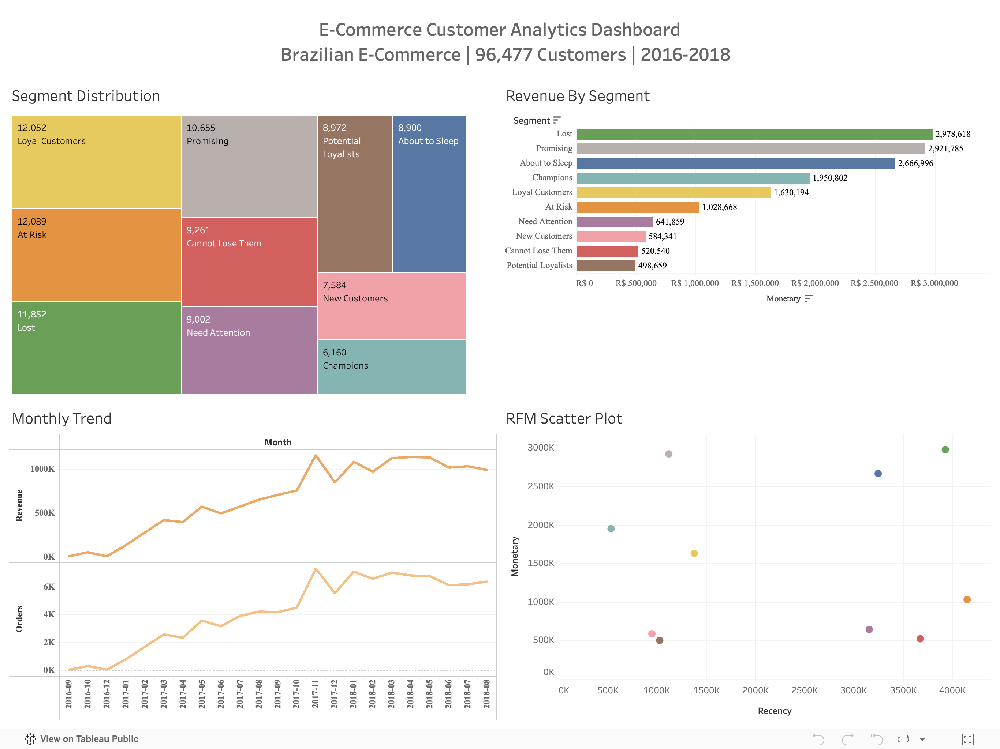

# E-Commerce Customer Analytics Platform


## 📊 Live Dashboard
**[View Interactive Dashboard on Tableau Public →](https://public.tableau.com/app/profile/poorna.venkat.neelakantam/viz/E-CommerceCustomerAnalyticsDashboard/Dashboard1)**



---

## 🎯 Project Overview

A comprehensive customer analytics solution analyzing **100,000+ orders** from a Brazilian e-commerce platform to identify customer segments, calculate RFM scores, and develop data-driven retention strategies.

### Business Problem
The e-commerce company needed to:
- Understand customer purchase behavior patterns
- Identify high-value customer segments for targeted marketing
- Develop strategies to reduce customer churn
- Optimize marketing spend through customer segmentation

### Solution
Built an end-to-end analytics pipeline that:
1. Integrated 5 disparate data sources into a unified dataset
2. Performed RFM (Recency, Frequency, Monetary) analysis
3. Applied K-Means clustering for customer segmentation
4. Created an interactive Tableau dashboard for stakeholder insights

---

## 📈 Key Findings

| Insight | Finding | Business Impact |
|---------|---------|-----------------|
| **Lost Revenue** | "Lost" customers represent R$ 2.9M in revenue | Priority win-back campaign needed |
| **Champions** | Only 6,160 customers (6.4%) are Champions | VIP program opportunity |
| **At Risk** | 12,039 customers showing churn signals | Immediate retention intervention |
| **Growth** | 10x revenue growth from 2016-2018 | Scalable business model confirmed |
| **Seasonality** | November peak (Black Friday effect) | Marketing calendar optimization |

### Customer Segment Distribution

| Segment | Customers | % of Total | Avg. Spend (R$) | Action |
|---------|-----------|------------|-----------------|--------|
| Loyal Customers | 12,052 | 12.5% | 135 | Upsell programs |
| At Risk | 12,039 | 12.5% | 85 | Retention campaigns |
| Lost | 11,852 | 12.3% | 251 | Win-back offers |
| Promising | 10,655 | 11.0% | 274 | Nurture to loyalty |
| Cannot Lose Them | 9,261 | 9.6% | 56 | High-touch engagement |
| Need Attention | 9,002 | 9.3% | 71 | Re-engagement emails |
| Potential Loyalists | 8,972 | 9.3% | 56 | Loyalty program invite |
| About to Sleep | 8,900 | 9.2% | 300 | Wake-up campaigns |
| New Customers | 7,584 | 7.9% | 77 | Onboarding sequence |
| Champions | 6,160 | 6.4% | 317 | VIP treatment |

---

## 🛠️ Technical Stack

| Category | Technologies |
|----------|--------------|
| **Languages** | Python 3.13, SQL |
| **Data Analysis** | Pandas, NumPy, Scikit-learn |
| **Visualization** | Tableau Public, Matplotlib, Seaborn |
| **Database** | MySQL |
| **Version Control** | Git, GitHub |

---

## 📁 Project Structure

```
02-Ecommerce-Customer-Analytics/
│
├── 📂 data/
│   ├── Raw/                          # Original CSV files from Kaggle
│   │   ├── olist_orders_dataset.csv
│   │   ├── olist_customers_dataset.csv
│   │   ├── olist_order_items_dataset.csv
│   │   ├── olist_order_payments_dataset.csv
│   │   └── olist_order_reviews_dataset.csv
│   │
│   └── Output/                       # Processed data files
│       ├── master_dataset.csv
│       ├── rfm_analysis_with_id.csv
│       ├── customer_geography.csv
│       ├── monthly_trend.csv
│       └── segment_summary.csv
│
├── 📂 notebooks/
│   ├── 01_data_exploration.ipynb     # Data loading & cleaning
│   ├── 02_rfm_analysis.ipynb         # RFM calculation & segmentation
│   └── 03_customer_segmentation.ipynb # K-Means clustering
│
├── 📂 sql/
│   ├── create_tables.sql             # Database schema
│   ├── load_data.sql                 # Data import queries
│   └── analysis_queries.sql          # Analytical queries
│
├── 📂 outputs/
│   ├── rfm_analysis.png              # RFM visualization
│   └── customer_clusters_3d.png      # 3D cluster plot
│
└── README.md
```

---

## 🔬 Methodology

### 1. Data Integration
- Merged 5 CSV files (orders, customers, items, payments, reviews)
- Created master dataset with 99,441 records and 17 features
- Handled missing values (2.98% in delivery dates)

### 2. RFM Analysis
Calculated three key metrics for 96,477 customers:

| Metric | Definition | Calculation |
|--------|------------|-------------|
| **Recency** | Days since last purchase | `snapshot_date - last_order_date` |
| **Frequency** | Total number of orders | `COUNT(order_id)` |
| **Monetary** | Total amount spent | `SUM(payment_value)` |

### 3. Customer Segmentation
- Applied quartile-based RFM scoring (1-4 scale)
- Created 10 customer segments based on RFM combinations
- Validated with K-Means clustering (optimal k=3, silhouette=0.485)

### 4. Visualization
Built interactive Tableau dashboard with:
- Segment distribution treemap
- Revenue by segment analysis
- Monthly trend analysis
- RFM scatter plot

---

## 💻 SQL Analysis Highlights

```sql
-- RFM Calculation Query
WITH customer_rfm AS (
    SELECT 
        c.customer_id,
        DATEDIFF('2018-08-30', MAX(o.order_purchase_timestamp)) as Recency,
        COUNT(DISTINCT o.order_id) as Frequency,
        SUM(p.payment_value) as Monetary
    FROM customers c
    JOIN orders o ON c.customer_id = o.customer_id
    JOIN payments p ON o.order_id = p.order_id
    WHERE o.order_status = 'delivered'
    GROUP BY c.customer_id
)
SELECT 
    customer_id,
    Recency,
    Frequency,
    Monetary,
    NTILE(4) OVER (ORDER BY Recency DESC) as R_Score,
    NTILE(4) OVER (ORDER BY Frequency) as F_Score,
    NTILE(4) OVER (ORDER BY Monetary) as M_Score
FROM customer_rfm;
```

---

## 🚀 How to Run

### Prerequisites
```bash
pip install pandas numpy matplotlib seaborn scikit-learn jupyter
```

### Steps
1. **Clone the repository**
   ```bash
   git clone https://github.com/poornavenkatn08/SQL-Projects.git
   cd SQL-Projects/02-Ecommerce-Customer-Analytics
   ```

2. **Download the dataset**
   - Get data from [Kaggle - Brazilian E-Commerce](https://www.kaggle.com/datasets/olistbr/brazilian-ecommerce)
   - Place CSV files in `data/Raw/`

3. **Run notebooks in sequence**
   ```bash
   jupyter notebook
   ```
   - `01_data_exploration.ipynb` → Creates master_dataset.csv
   - `02_rfm_analysis.ipynb` → Creates rfm_analysis_with_id.csv
   - `03_customer_segmentation.ipynb` → Creates cluster analysis

4. **View the dashboard**
   - [Tableau Public Link](https://public.tableau.com/app/profile/poorna.venkat.neelakantam/viz/E-CommerceCustomerAnalyticsDashboard/Dashboard1)

---

## 📊 Related Work

| Repository | Description |
|------------|-------------|
| 📊 [Tableau Dashboard](https://public.tableau.com/app/profile/poorna.venkat.neelakantam/viz/E-CommerceCustomerAnalyticsDashboard/Dashboard1) | Interactive visualization |
| 🐍 [Python Analysis](https://github.com/poornavenkatn08/Python_Pandas-Data-Analysis-Portfolio/tree/main/01-ecommerce-rfm-analysis) | Jupyter notebooks & ML models |
| 📈 [Dashboard Portfolio](https://github.com/poornavenkatn08/dashboards-portfolio) | All Tableau dashboards |

---

## 📝 Business Recommendations

Based on the analysis, here are actionable recommendations:

1. **Win-Back Campaign for Lost Customers**
   - Target: 11,852 customers representing R$ 2.9M potential revenue
   - Action: Personalized discount offers + product recommendations

2. **VIP Program for Champions**
   - Target: 6,160 high-value customers
   - Action: Exclusive early access, loyalty rewards, dedicated support

3. **Retention Alert System**
   - Target: 12,039 At-Risk customers
   - Action: Automated triggers when purchase frequency drops

4. **Seasonal Marketing Optimization**
   - Insight: November shows 40% revenue spike
   - Action: Increase ad spend and inventory for Q4

---

## 📜 Dataset Information

**Source:** [Brazilian E-Commerce Public Dataset by Olist](https://www.kaggle.com/datasets/olistbr/brazilian-ecommerce)

| File | Records | Description |
|------|---------|-------------|
| orders | 99,441 | Order timestamps and status |
| customers | 99,441 | Customer location data |
| order_items | 112,650 | Product and pricing details |
| payments | 103,886 | Payment methods and values |
| reviews | 99,224 | Customer ratings and comments |

---

## 👤 Author

**Poorna Venkat Neelakantam**

- 🔗 [LinkedIn](https://linkedin.com/in/pneelakantam)
- 💻 [GitHub](https://github.com/poornavenkatn08)
- 📊 [Tableau Public](https://public.tableau.com/app/profile/poorna.venkat.neelakantam)

---

## 📄 License

This project is for educational and portfolio purposes. Dataset is provided by Olist under [CC BY-NC-SA 4.0](https://creativecommons.org/licenses/by-nc-sa/4.0/).
